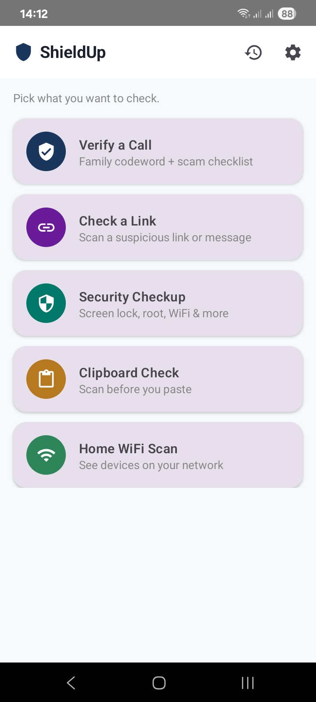
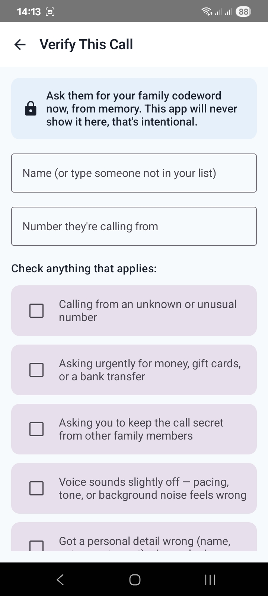
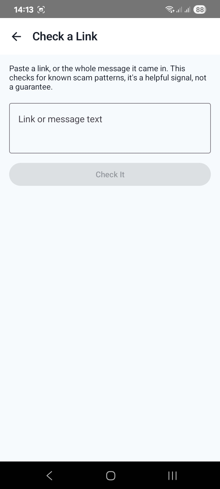
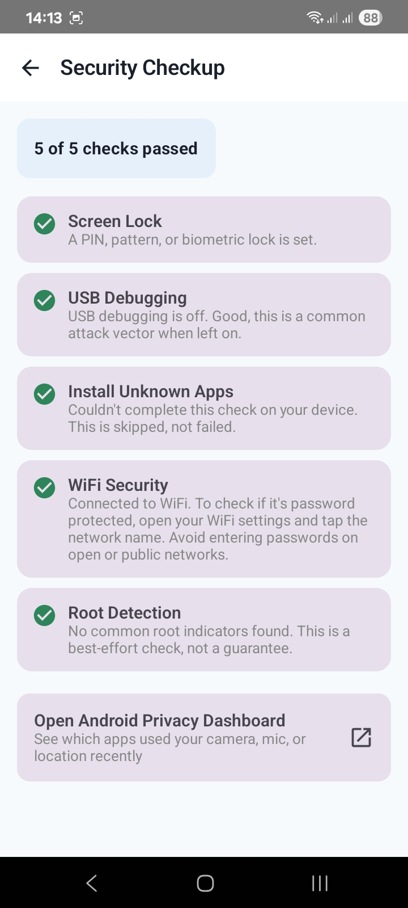
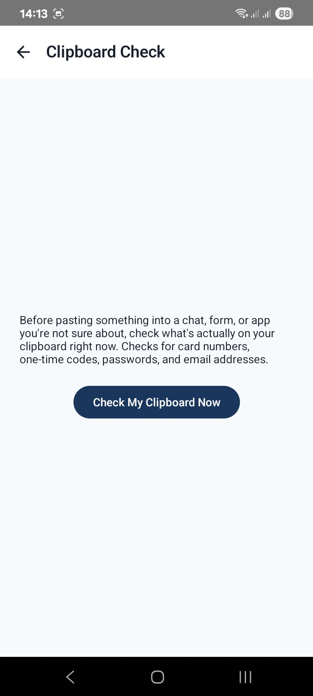
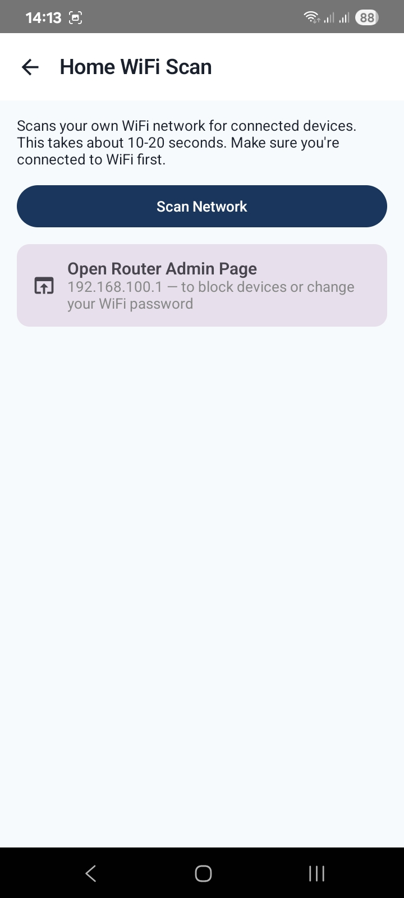

# ShieldUp — Personal Safety and Security Toolkit

ShieldUp is a five module personal safety app: verify suspicious calls, check suspicious links, run a device security checkup, check your clipboard before pasting, and scan your home WiFi for unrecognized devices. Built for personal use, with an explicit design principle: every check here is either a manual, user initiated scan, or a real Android system API, never a passive background scan of other apps.

## Screenshots

| Home | Verify a Call | Check a Link |
|---|---|---|
|  |  |  |

| Security Checkup | Clipboard Check | Home WiFi Scan |
|---|---|---|
|  |  |  |

## Why that principle matters

Android deliberately blocks apps from monitoring other apps' background activity, reading other apps' data such as cookies, keyboard dictionaries, or message content, or detecting hacking in progress. There is no OS API for any of that, on purpose, because that capability is exactly what spyware relies on. An app claiming to do those things is either lying or is itself something to be suspicious of. ShieldUp is built entirely within what is actually possible, which is still genuinely useful.

## Module 1: Verify a Call

Set a private family codeword, shared in person, never over text or a call. When a call claims to be from family and asks for urgent money, work through a six item red flag checklist. You can pick who they claim to be from your saved family contacts, or type a name if it is someone new. The codeword is never shown on screen during this flow, only a reminder to ask for it from memory, so it cannot leak even if someone can see your screen during the call. After checking, you get a clear verdict and, if the caller matches a saved contact, a one tap button to call them back on their real saved number.

## Module 2: Check a Link

Paste a link, or the whole message it came in. ShieldUp extracts the actual URL from the text and checks it two ways. First, local wording pattern checks look for suspicious domain endings, URL shorteners, urgency language, lookalike brand domains, and raw IP addresses. Second, if you add a free Google Safe Browsing API key in Settings, the URL is checked against Google's own live malware and phishing database, the same one Chrome and Android itself use. The local patterns alone will miss real malicious links, since attackers constantly rotate through fresh, ordinary looking domains, so the Safe Browsing key is what turns this from a rough guess into genuine detection.

## Module 3: Security Checkup

Runs five real checks using legitimate Android APIs. Screen lock status. USB debugging and developer options status. Unknown sources or sideloading status. WiFi connection awareness. A best effort root or jailbreak heuristic based on common file paths, clearly labeled as not a guarantee. Each check is isolated so that if one fails on a particular device, the rest still run and the screen never crashes. Also includes a one tap link into Android's own Privacy Dashboard, which already tracks camera, microphone, and location access per app far better than a third party app could rebuild.

## Module 4: Clipboard Check

A manual, on demand check of your current clipboard content. Flags card numbers, one time passcodes, password like strings, and email addresses before you paste them somewhere you should not. Shows a masked preview of what is on your clipboard so you can confirm what was checked without exposing the full value on screen.

## Module 5: Home WiFi Scan

Pings your own local subnet and reads the on device ARP table to list devices on your home network. Label known devices once, and unrecognized ones are flagged automatically from then on. Includes a one tap shortcut to your router's real admin page, since actual blocking or password changes belong there, on real router credentials, never faked inside the app. Spoofing or forcing devices off a network without real authorization would be an attack technique, not a feature, so ShieldUp intentionally does not attempt it.

## Tech Stack

Kotlin, Jetpack Compose with Material 3, and Navigation Compose for the UI layer. Coroutines power the parallel subnet ping sweep in the WiFi scanner. SharedPreferences handles all local storage, so the app is fully offline except for the WiFi scan module, which only ever talks to devices on your own local network.

## Project Structure

The app lives under app/src/main/java/com/tahirabbas/shieldup, split into three packages. The data package holds FamilyContact and FamilyContactRepository, CodewordRepository, RedFlag and SuspiciousCallEntry and CallLogRepository, and KnownDeviceRepository. The utils package holds LinkCheckHelper, SecurityCheckHelper, ClipboardCheckHelper, and WifiScanHelper. The ui package holds the theme files and every screen: HomeScreen, VerifyCallScreen, CodewordSetupScreen, FamilyContactsScreen, CallLogScreen, LinkCheckerScreen, SecurityCheckupScreen, ClipboardCheckScreen, WifiScannerScreen, and SettingsScreen, tied together by NavGraph.

## Running It

Open the project root in Android Studio and let Gradle sync. Run on a physical device rather than an emulator for the WiFi Scanner module, since emulators do not have a real local network to scan. On first launch, set your family codeword and add contacts through Settings before testing the Verify Call flow.
